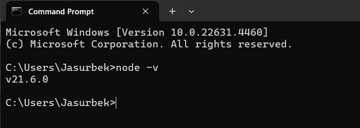

# JS exercises

## Instructions
Make sure you have stable version of Node.js installed in your computer.
Check by running the following command in your terminal.
```shell
node -v
```
You should see similar result like this:

If you don't see version number, it means you don't have Node.js installed in your computer.

Next. Install necessary packages by running the following command in your terminal:
```shell
npm install
```