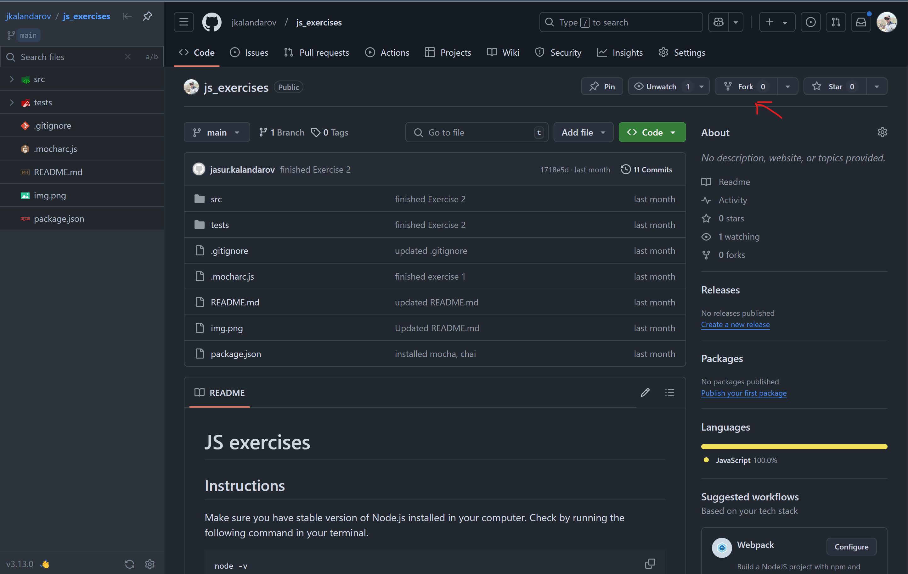
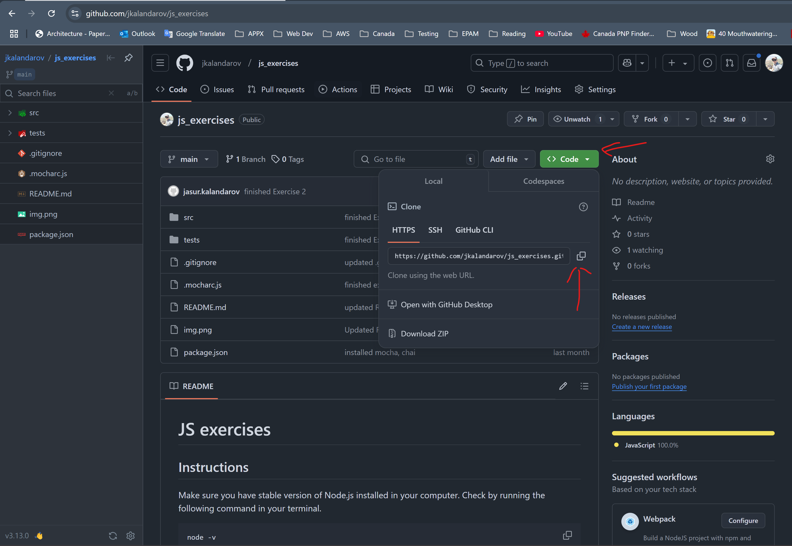

# JS exercises

## Instructions
Make sure you have stable version of Node.js installed in your computer.
Check by running the following command in your terminal.
```shell
node -v
```
You should see similar result like this:

If you don't see version number, it means you don't have Node.js installed in your computer.

Next. Install necessary packages by running the following command in your terminal:
```shell
npm install
```

### Fork the repository


### Clone the repository to your local machine


### Complete the tasks in `src` folder
1. Create a separate branch from `main`.
2. Complete tasks.
3. Commit your changes.
4. Push your changes.
5. Open pull request on GitHub.
6. Send the link to your pull request to us.